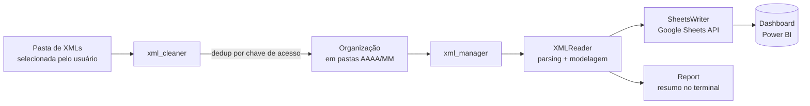

# 📊 Gerenciador de Compras via NF-e

**Pipeline ETL em Python que transforma XMLs de Nota Fiscal Eletrônica em um dashboard de compras pronto para análise.**


<!-- TODO: adicionar aqui um screenshot ou GIF do dashboard final no Power BI/Sheets -->

## 📌 Sobre o projeto

Empresas que recebem notas fiscais eletrônicas (NF-e) em XML normalmente lidam com centenas de arquivos espalhados em pastas, sem estrutura nem consolidação — o que torna qualquer análise de compras, fornecedores ou parcelas um processo manual e propenso a erro.

Este projeto automatiza essa etapa: lê os XMLs brutos, remove duplicidades, organiza os arquivos por competência (ano/mês) e extrai os dados fiscais relevantes (fornecedor, valor, parcelas, produtos) para uma planilha estruturada no Google Sheets, que alimenta um dashboard de compras no Power BI.

É o meu primeiro projeto de dados ponta a ponta — da ingestão de um formato de arquivo real e complicado (XML fiscal com namespace) até a entrega de um artefato analisável.

## ✨ Funcionalidades

- **Parsing de XML fiscal** com namespace da NF-e (`http://www.portalfiscal.inf.br/nfe`), extraindo emitente, CNPJ, número da nota, data de emissão, parcelas e itens
- **Deduplicação idempotente**: cada nota é identificada pela sua chave de acesso (44 dígitos, extraída do atributo `Id`), então rodar o pipeline várias vezes sobre a mesma pasta nunca duplica registros
- **Organização automática** dos XMLs processados em subpastas `AAAA/MM`, replicando a estrutura de competência fiscal
- **Modelagem de domínio** com `dataclasses` (`Purchase`, `Installment`, `Product`), separando claramente o modelo de dados da lógica de extração
- **Exportação em três dimensões** — compras, parcelas e produtos — para o Google Sheets via API, prontas para virar tabelas de um modelo Power BI
- **Relatório de execução** no terminal (notas processadas, fornecedores únicos, produtos, parcelas, valor total)
- **Tratamento defensivo de erros**: um XML malformado ou uma nota com campo faltante é logada e pulada, sem derrubar o processamento do lote inteiro

## 🏗️ Arquitetura

O pipeline é dividido em dois módulos desacoplados, cada um com uma responsabilidade clara:



## 🧱 Estrutura do projeto

```
Gerenciador de compras via NF-e/
├── xml_cleaner/                  # Etapa 1 — higienização dos arquivos brutos
│   ├── select_folder.py          # Seleção da pasta de origem (GUI)
│   ├── remove_duplicates.py      # Deduplicação por chave de acesso da NF-e
│   ├── organize_by_date.py       # Organização em pastas AAAA/MM
│   └── xml_utils.py              # Utilitários de leitura de XML
│
└── xml_manager/                  # Etapa 2 — extração, modelagem e exportação
    ├── extractor/
    │   └── xml_reader.py         # Parsing do XML com namespace fiscal
    ├── models/
    │   ├── purchase.py           # Dataclasses: Purchase, Installment
    │   └── product.py            # Dataclass: Product
    ├── output/
    │   ├── sheets_writer.py      # Escrita no Google Sheets (gspread)
    │   └── excel_writer.py       # Escrita alternativa em .xlsx (openpyxl)
    └── utils/
        └── report.py             # Resumo estatístico da execução
```

## 🛠️ Stack técnica

| Categoria             | Tecnologias                                      |
|------------------------|---------------------------------------------------|
| Linguagem              | Python 3.12                                       |
| Parsing de XML         | `xml.etree.ElementTree` (com namespaces fiscais)  |
| Modelagem de dados     | `dataclasses`                                     |
| Exportação             | `gspread`, `google-auth`, `openpyxl`              |
| Configuração           | `python-dotenv`                                   |
| Interface              | `tkinter` (seleção de pasta)                      |
| Visualização           | Power BI / Google Sheets                          |

## ⚙️ Destaque técnico: deduplicação idempotente

Cada NF-e carrega, no atributo `Id` do XML, sua chave de acesso — um identificador único de 44 dígitos. Antes de copiar qualquer arquivo, `remove_duplicates.py` varre o que já foi organizado em execuções anteriores, monta um conjunto (`set`) dessas chaves, e só processa notas cuja chave ainda não existe. Isso garante que o pipeline seja **idempotente**: pode ser executado repetidamente sobre a mesma pasta de origem — ou até com pastas de meses diferentes se sobrepondo — sem nunca contar a mesma compra duas vezes.

## 🚀 Como rodar localmente

```bash
git clone https://github.com/ezequiel-d-almeida/gerenciador-compras-nfe.git
cd "Gerenciador de compras via NF-e"

python -m venv .venv
.venv\Scripts\activate        # Windows
pip install -r xml_manager/requirements.txt
```

Configure um arquivo `.env` na raiz do projeto:

```env
GOOGLE_SHEET_ID=<id_da_sua_planilha>
GOOGLE_CREDENTIALS=<caminho_para_credentials.json>
```

`credentials.json` é a chave de uma Service Account do Google Cloud com acesso à Sheets API e à Drive API — compartilhe a planilha de destino com o e-mail dessa conta como **Editor**. Tanto `.env` quanto `credentials.json` já estão no `.gitignore`, então nenhuma credencial é versionada.

Depois, basta rodar o pipeline completo:

```bash
python xml_cleaner/main.py
```

Uma janela pedirá a pasta com os XMLs; o restante — dedup, organização, extração e escrita na planilha — é automático.

## 📌 Roadmap

- [ ] Tipar `data_emissao` e `vencimento` como `date` nativo, evitando ambiguidade de formato na leitura por ferramentas de BI
- [ ] Padronizar o destino de escrita (hoje `ExcelWriter` e `SheetsWriter` coexistem; consolidar em um único fluxo configurável)
- [ ] Testes automatizados (`pytest`) para o parsing de XML e a lógica de deduplicação
- [ ] Containerização com Docker para facilitar a execução em qualquer máquina
- [ ] Agendamento automático da execução (cron / Task Scheduler)

## 👤 Autor

**Ezequiel** — estudante de Ciência de Dados (UFMS), em transição para uma vaga júnior em dados/desenvolvimento.

[GitHub](https://github.com/ezequiel-d-almeida) · [LinkedIn](https://www.linkedin.com/in/almeida-ezequiel)

---

Contribuições, sugestões e code review são bem-vindos — este projeto está em evolução ativa.